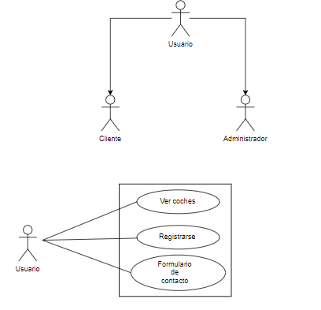
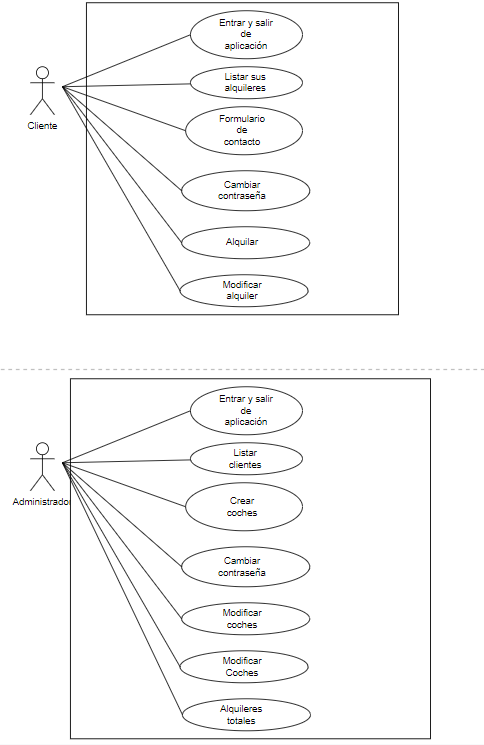
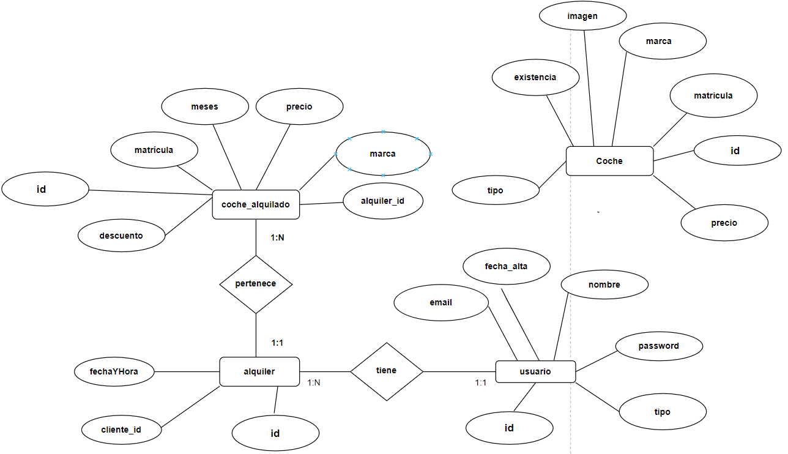
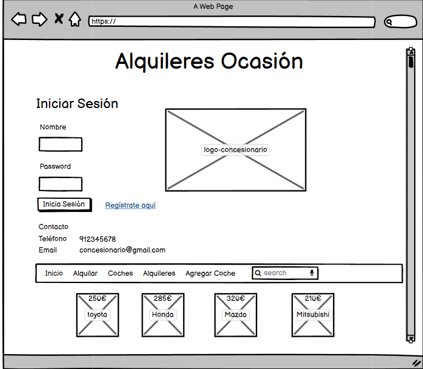
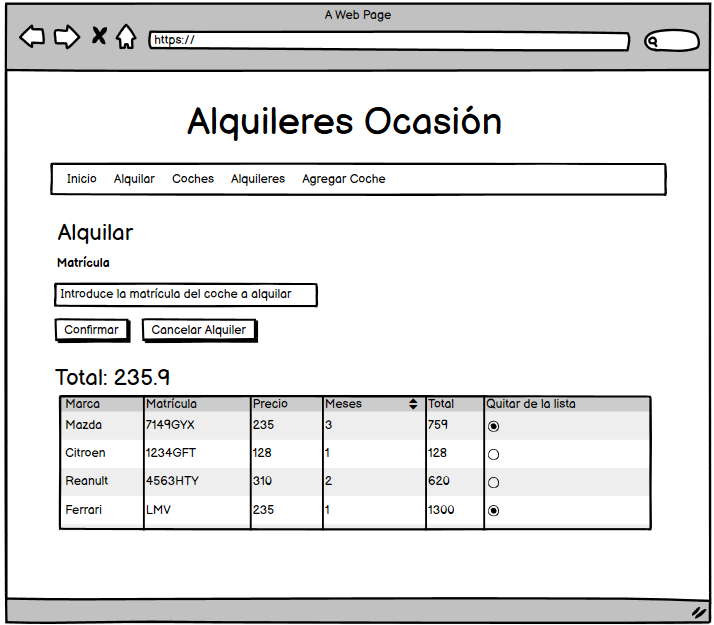
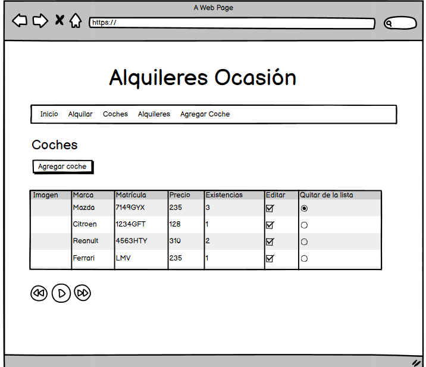
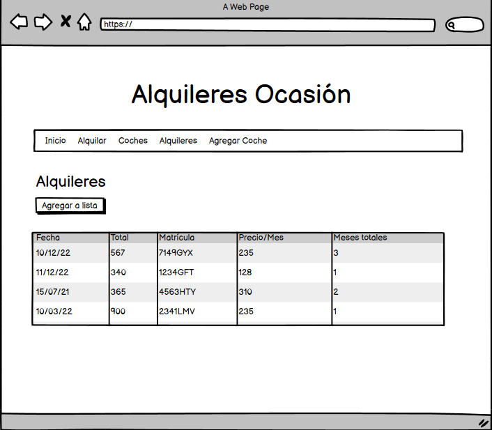
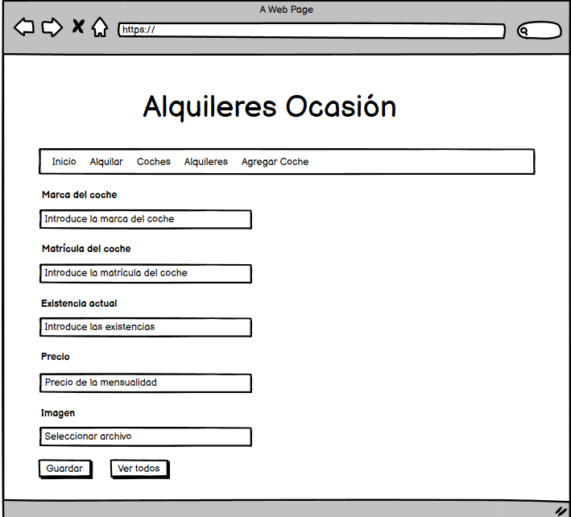
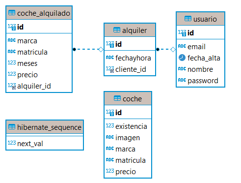

# Concesionario

## Índice
- [1.1 Introducción](#introduccion) 															
- [1.2 Justificación del proyecto](#justificacion)  						       	   	  
- [1.3 Planificación](#planificacion)
- [1.4 Parte experimental](#parte_experimental) 
    - [1.4.1 Análisis](#analisis)
    - [1.4.2 Diseño](#diseño)
    - [1.4.3 Implementación y pruebas](#implementacion_pruebas)
    - [1.4.4 Implantación y documentación](#implantacion_documentacion)
    - [1.4.5 Resultados y discusión](#resultados_discusion)     
- [1.5 Conclusión](#conclusion) 
- [1.6 Bibliografía y referencias](#referencias) 


<a name="introduccion"></a>						     		
## 1.1 Introducción 

El proyecto consiste en la implementación de un concesionario online que planea expandir su negocio, y ganar presencia digital, además de facilitar la gestión de alquileres a través de una plataforma intuitiva para el usuario. Los usuarios podrán registrarse como clientes, editar su perfil, hacer reservas online, consultar su historial de alquileres y obtener información sobre los vehículos ofertados en la plataforma.

### Entorno Servidor

            ▪ Spring
            ▪ MySQL
            ▪ MVC
            ▪ Servicios REST
            
Esta aplicación realizada en Java, usando programación orientada a objetos y utilizando el modelo vista-controlador
La base de datos está gestionada a través de dbeaver, y cuenta con las tablas coche, cliente, alquiler, factura y cocheAlquilado.

### Entorno Cliente

            ▪ AJAX

            ▪ Thymeleaf

Se utilizará un motor de plantillas para implementar la interfaz visual. Por otro lado, se filtran el historial de coches reservados por un cliente a través de AJAX.

### Diseño de interfaces

            ▪ Bootstrap
            ▪ HTML5
            ▪ CSS
            ▪ JavaScript
            
### Despliegue de aplicaciones web

            ▪ Docker

            ▪ Spring Boot

<a name="justificacion"></a>
## 1.2 Justificación del proyecto y objetivos

El motivo de la elección de este proyecto se basa en la idea de implementar un comercio electrónico relacionado con la automoción. A través del uso de Spring, se puede conseguir una plataforma intuitiva, sencilla y funcional para que un usuario que visite la web pueda convertirse en cliente, y comprar a través de la misma. Esta misma plataforma también podría vender accesorios para coches. En principio, este portal está dirigido a todo aquel usuario que precise del alquiler de un vehículo para poder desplazarse durante un periodo determinado de tiempo.
El mercado cuenta actualmente con grandes competidores a nivel nacional e internacional. Muchos de estos, implementan servicios más personalizados como renting, que consiste en un alquiler a largo plazo.

<a name="planificacion"></a>
## 1.3 Planificación

            ▪ Como usuario, se requiere poder loguearse en la plataforma como cliente, para así poder alquilar los coches disponibles.
            ▪ Como usuario, se requiere identificar la identidad de la empresa desde el menú principal.
            ▪ Como administrador, se requiere poder editar los datos de un cliente, visualizarlo y eliminarlo.
            ▪ Como administrador, se requiere poder subir fotos de coches nuevos en la plataforma.
            ▪ Como usuario, se requiere filtrar resultados de coches disponibles en la base de datos.
            ▪ Como usuario, se requiere filtrar historial de alquileres.
            ▪ Como administrador, se requiere obtener historial de alquileres en la plataforma por parte de los usuarios.
            ▪ Como administrador, se requiere tener secciones exclusivas que un usuario sin permisos no puede ver.
            ▪ Como administrador, se requiere ver la lista de coches contando con una paginación.
            ▪ Como administrador, se requiere poder hacer un drag & drop para las fotos de los nuevos vehículos registrados en la plataforma.
            
<a name="parte_experimental"></a>
## 1.4 Parte experimental           
  <a name="analisis"></a>
  ### 1.4.1 Análisis
  
  ### Casos de uso
  
  
  
  Imagen 1. Resumen de los casos de uso de la plataforma con dos tipos de usuarios: Cliente y administrador.
  
  
  
  Imagen 2. Detalles de casos de uso de cada tipo de usuario.
  
  ### Diagrama E/R
  
  
 
 Imagen 3. Detalles de las 4 tablas principales usadas en la plataforma junto con sus relaciones.
  
    • La aplicación constará de un menú principal en el cual un usuario no registrado puede ver los coches disponibles, mandar formulario de contacto y registrarse   como cliente o administrador, en una ventana nueva. Además, también puede ver los detalles de un coche, en una ventana adicional.
    • El usuario de tipo cliente podrá ver el historial de alquileres realizados, cancelar un alquiler y ver sus facturas.
    • El usuario de tipo cliente podrá alquilar coches ingresando la matrícula del mismo, pudiendo alquilar un mismo coche varios meses, o alquilar varios coches durante x número de meses.
    • Tanto un cliente como administrador tendrán la posibilidad de filtrar coches por medio de un buscador situado en la navegación de la página principal.
    • El usuario de tipo administrador, tendrá acceso a varias pantallas que no ven los demás usuarios como editar coche, ver usuarios, ver alquileres totales y registrar coches nuevos.

### Prototipado

### Home

  
  
  Imagen 4. Representación de pantalla principal de la plataforma con varios enlaces y botones que redirigen a otras secciones.

    • En la home principal encontramos el título del portal y un logo del mismo.
    • Un usuario puede iniciar sesión por medio del input, además de ser redirigido a otra ventana para registrarse.
    • Aparece información de contacto, además de la barra de navegación junto con un buscador.
    • Finalmente, un usuario puede ver los coches disponibles para alquilar.
    • El usuario también puede mandar una consulta a través del formulario que se encuentra en el footer de la página principal.

### Alquilar

  
  
  Imagen 5. Representación de la interfaz de alquilar que permite añadir coches para un alquiler.
  
    • En la interfaz alquilar, un usuario de tipo cliente podrá introducir la matrícula del coche en cuestión, y añadirla a su lista de alquileres.
    • Se muestra el total que supondría la suma de los coches que se quieren alquilar, además de un desglose en una tabla subyacente de los detalles de los coches.
    • Finalmente, la interfaz incluye la función de cancelar todos los alquileres mediante el botón “cancelar alquiler”, o quitarlos de manera individual mediante el botón de la tabla.
    
 ### Coches

  
 
 Imagen 6. Representación de la interfaz Coches, la cual permite al administrador ver la flota de coches.
  
    • En la interfaz coches, el usuario puede ver la selección de coches disponibles en la plataforma de una manera más detallada.
    • El botón “agregar coche” redirige a la interfaz Agregar Coche, la cual permite la introducción en la plataforma de un nuevo vehículo disponible para alquilar.
    • En la tabla que muestra la información de cada coche, también aparecen dos botones para editar un coche, o eliminarlo del sistema.
    • Finalmente, la interfaz cuenta con un bloque de paginación, que permite en este caso navegar por los distintos vehículos de manera ordenada.
    
 ### Alquileres

  
  
  Imagen 7. Interfaz de Alquileres la cual permite a un usuario ver su historial de alquileres.
  
    • En la pantalla alquileres, se desglosan todos los alquileres que se han realizado en la plataforma mediante una tabla.
    • La tabla muestra la fecha en la que tuvo lugar un alquiler, y los detalles de dicho alquiler como son la matrícula, los meses reservados, precio/mes y el total que se ha pagado.
    • En el botón “Agregar a la lista” le redirige a uno a la interfaz Alquilar para poder añadir un alquiler.

 ### Agregar Coche

  
  
  Imagen 8. Interfaz para agregar coches a la plataforma mediante credenciales de administrador.
  
    • En Añadir coche, el administrador del portal podrá introducir un nuevo vehículo para alquilar mediante una serie de inputs.
    • Entre estos campos, se incluye la inserción de fotos para los coches a través de archivos.
    • Cuando los registros estén listos, el botón “Guardar” inserta en la base de datos un vehículo nuevo.
    • El botón “Ver todos” redirige a la interfaz Ver todos, donde se muestran todos los coches disponibles en la plataforma hasta el momento.

 ### Añadir Usuario

  
  
  Imagen 9. Interfaz para añadir usuarios a la base de datos, disponible para administrador y usuarios.
  
    • En esta interfaz, tanto el usuario como el administrador podrán registrar a nuevos usuarios.
    • Incluye la inserción de una contraseña con el formato “password” la cual identifica a los diferentes usuarios.
    • Cuando los campos han sido rellenados, el botón “Guardar” registra un nuevo usuario en la plataforma.
    • El boton “Volver al inicio” redirige al usuario al inicio de la plataforma.

   <a name="diseño"></a>
   ### 1.4.2 Diseño
   
   
   
   Imagen 10. Detalles de las tablas utilizadas. Imagen obtenida de DBeaver.
   
    • La aplicación contiene 4 tablas, las cuales albergan toda la información necesaria para el funcionamiento de la misma.
    • En primer lugar, la tabla coche permite mostrar un catálogo de coches de manera estática al usuario de la plataforma. El administrador de la plataforma se encarga de la gestión de los coches disponibles, así como la introducción de modelos nuevos.
    • La tabla usuario tiene como finalidad identificar a los clientes de la plataforma a la hora de realizar alquileres.  Contiene información del cliente, de manera que el administrador puede consultar los clientes que han alquilado coches. 
    • Por otro lado, la tabla alquiler registra la fecha y la hora en la cual se ha realizado un alquiler por parte de un cliente.
    • Finalmente, la tabla coche_alquilado tiene una relación de ManyToOne con respecto a la tabla alquiler. De esta manera, los alquileres realizados son guardados y pueden ser consultados por el administrador.

 ### Tecnologías utilizadas
 
 La aplicación se desarrolla en su mayor parte usando el lenguaje Java, aunque contiene otras partes realizadas en lenguaje cliente Javascript.

Cabe destacar que la utilización de software libre, con lo que se ahorra en concepto de licencias. Este Software es una de las tecnologías más usadas en la actualidad en el desarrollo de aplicaciones web debido a su fiabilidad y versatilidad. Otro punto a destacar, es que el lenguaje escogido va asociado al framework.

En este caso, el framework de desarrollo seleccionado es Spring Boot. Ha sido seleccionado por las siguientes razones:

        ◦ Es un framework gratuito, que implementa el Modelo-Vista-Controlador, lo cual es recomendable para el mantenimiento de aplicaciones.
        ◦ Está implementado en el lenguaje Java, lo cual presenta una gran ventaja, ya que es uno de los lenguajes más extendidos en el mundo.
        ◦ Existe una gran comunidad de desarrolladores Java, que utilizan Spring Boot como framework de desarrollo. Como consecuencia, se pueden encontrar multitud de módulos reutilizables ya probados que podemos añadir a nuestro código de manera sencilla.
        ◦ Buena comunicación entre el front-end y el back-end, gracias a la utilización de Thymeleaf como motor de plantillas.
        ◦ Organiza el proyecto en paquetes o módulos, los cuales cumplen una función dentro de la aplicación.

            ▪ Configuración: En el caso de Spring Security, implementa la funcionalidad de login a una apliación mediante la anotación @Configuration.
            ▪ Controlador: Se encarga de comunicar la arquitectura del proyecto, con el motor de plantillas, para que este pueda renderizar aquello que está programado con Java, mediante la anotación @Controller.
            ▪ Modelo: Contiene las entidades de la plataforma, que a su vez son tablas en el motor de base de datos. Se utiliza la anotación @Entity.
            ▪ Repositorios: Contiene interfaces, que junto con Jpa, añaden funcionalidades una vez implementadas por clases. Utilizan la anotación @Repository.
            ▪ Servicios: Son clases que implementan las interfaces de repositorios, además de poder añadir funcionalidades aparte a través de métodos o funciones. Utilizan la anotación @Service.
            
### Motor de base de datos

El motor de base de datos escogido es MySQL, dado que presenta grandes ventajas 	
frente a otros motores disponibles actualmente.
Adicionalmente, se usa un ORM para Java que facilita el mapeo de atributos en una base de datos relacional, de modo que agiliza la relación entre una aplicación y una base de datos, optimizando el flujo de trabajo.

        ◦ Su adquisición es gratuita, lo que permite reducción de costes para el cliente.
        ◦ Es multiplataforma para Windows, Linux y Mac, con lo cual se podrá usar en cualquiera de estos sistemas operativos.
        ◦ Al ser un motor muy extendido entre la comunidad de desarrolladores, es sencillo encontrar ayuda.
        ◦ La labor de mantenimiento de una base de datos MySQL es relativamente sencilla frente a sus competidores, ya que presenta menos funciones. Lejos de ser una desventaja, esto se presenta como un punto a favor, ya que supone que el mantenimiento de la aplicación lo puede llevar el propio desarrollador, sin tener que recurrir a un administrador de bases de datos.
        ◦ Finalmente, es escalable, lo cual lo convierte en una gran ventaja si se quiere ampliar la extensión del proyecto.
        
 <a name="implementacion_pruebas"></a>
   ### 1.4.3 Implementación y pruebas 
   
La plataforma cuenta con varios controladores que permiten desplegar la información almacenada en la base de datos mediante el motor de plantillas Thymeleaf. En la página principal, se muestra la lista de coches disponibles para alquilar mediante los siguientes métodos:
   
   ```
   
   @GetMapping("/")
    public String index(Model model,@RequestParam(name = "q", required = false) String consulta) {
        
        List<Coche> resultado = (consulta == null) ? cocheService.findAll() : cocheService.buscador(consulta);
        model.addAttribute("coches", resultado);
        return "home";
    }

    @GetMapping("/coche/{id}")
    public String showDetails(@PathVariable("id") Integer id, Model model) {
        Coche coche = cocheService.findById(id);
        if (coche != null) {
            model.addAttribute("coche", coche);
            return "coche";
        }

        return "redirect:/";

    }
    
   ```
El primer método recoge todos los coches disponibles mediante la clase “CocheService” que implementa a su vez la interfaz “CocheRepository”, y los muestra en la plantilla “home”, mientras que en el segundo método se muestran detalles de un coche de manera individual. 

Por otro lado, la implementación CRUD de la aplicación se encuentra en un controlador llamado “Agregar Controller” de la siguiente manera:

```
@GetMapping(value = "/agregar")
    public String agregarCoche(Model model) {
        model.addAttribute("coche", new Coche());
        return "coches/agregar_coche";
    }

   

@PostMapping(value = "/agregar")
    public String guardarCoche(@ModelAttribute("coche") @Valid Coche coche, @RequestParam("file") MultipartFile file, BindingResult bindingResult, RedirectAttributes redirectAttrs) throws IOException {
        if (bindingResult.hasErrors()) {
            return "coches/agregar_coche";
        }
        if (cocheRepository.findFirstByMatricula(coche.getMatricula()) != null) {
            redirectAttrs
                    .addFlashAttribute("mensaje", "Ya existe un coche con esa matricula")
                    .addFlashAttribute("clase", "warning");
            return "redirect:/coches/agregar";
        }

        if (!file.isEmpty()) {
            String imagen = storageService.store(file);
            coche.setImagen(MvcUriComponentsBuilder
                    .fromMethodName(FilesController.class, "serveFile", imagen).build().toUriString());
        }


        cocheRepository.save(coche);
        redirectAttrs
                .addFlashAttribute("mensaje", "Agregado correctamente")
                .addFlashAttribute("clase", "success");
        return "redirect:/coches/agregar";
    }
```
El primer método “agregarCoche” recoge los campos de la plantilla de thymeleaf, y los agrega a un objeto coche. Después, mediante el método “guardarCoche” se manda la información introducida por el usuario en la plantilla a la base de datos. Este método también incluye la inserción de una imagen para un nuevo registro de objeto coche. 

Finalmente, el controlador “AlquilarController” incluye los métodos más complejos de la aplicación, ya que estos incluyen el registro de alquileres realizados por un cliente, y la suma de los mismos.

```
private ArrayList<CocheParaAlquilar> obtenerCarrito(HttpServletRequest request) {
        ArrayList<CocheParaAlquilar> carrito = (ArrayList<CocheParaAlquilar>) request.getSession().getAttribute("carrito");
        if (carrito == null) {
            carrito = new ArrayList<>();
        }
        return carrito;
    }

    private void guardarCarrito(ArrayList<CocheParaAlquilar> carrito, HttpServletRequest request) {
        request.getSession().setAttribute("carrito", carrito);
    }
    
```

Mediante estos dos métodos, se crea un arraylist de coches que desea el usuario, que a su vez se guarda en una sesión mediante el segundo método mostrado.

```
@GetMapping(value = "/")
    public String interfazAlquiler(Model model, HttpServletRequest request) {
        model.addAttribute("coche", new Coche());
        float total = 0;
        ArrayList<CocheParaAlquilar> carrito = this.obtenerCarrito(request);
        for (CocheParaAlquilar coche: carrito) total += coche.getTotal();
        model.addAttribute("total", total);
        return "alquilar/alquilar";
    }
    
```
“interfazAlquiler” obtiene los atributos del coche y por otro lado recorre el carrito que encuentra el coche en cuestión, para después sumar el precio al total de la operación.

```
@PostMapping(value = "/agregar")
    public String agregarAlCarrito(@ModelAttribute Coche coche, HttpServletRequest request, RedirectAttributes redirectAttrs) {
        ArrayList<CocheParaAlquilar> carrito = this.obtenerCarrito(request);
        Coche cocheBuscadoPorMatricula = cocheRepository.findFirstByMatricula(coche.getMatricula());
        if (cocheBuscadoPorMatricula == null) {
            redirectAttrs
                    .addFlashAttribute("mensaje", "El coche con matricula " + coche.getMatricula() + " no existe")
                    .addFlashAttribute("clase", "warning");
            return "redirect:/alquilar/";
        }
        if (cocheBuscadoPorMatricula.sinExistencia()) {
            redirectAttrs
                    .addFlashAttribute("mensaje", "El coche no está disponible")
                    .addFlashAttribute("clase", "warning");
            return "redirect:/alquilar/";
        }
        boolean encontrado = false;
        for (CocheParaAlquilar cocheParaAlquilar : carrito) {
            if (cocheParaAlquilar.getMatricula().equals(cocheBuscadoPorMatricula.getMatricula())) {
                cocheParaAlquilar.aumentarMeses();
                encontrado = true;
                break;
            }
        }
        if (!encontrado) {
            carrito.add(new CocheParaAlquilar(cocheBuscadoPorMatricula.getMarca(), cocheBuscadoPorMatricula.getMatricula(), cocheBuscadoPorMatricula.getPrecio(), cocheBuscadoPorMatricula.getExistencia(), cocheBuscadoPorMatricula.getId(), 1f,cocheBuscadoPorMatricula.getImagen()));
        }
        this.guardarCarrito(carrito, request);
        return "redirect:/alquilar/";
    }
    
```
Este método recoge la matrícula introducida por el usuario en la interfaz, y si coincide con un registro de coches de la base de datos, lo guarda en la sesión del carrito. Si esta operación se realiza de nuevo, aumenta el número de meses totales, al igual que el precio total del alquiler.

```
@PostMapping(value = "/terminar")
    public String firmarAlquiler(HttpServletRequest request, RedirectAttributes redirectAttrs) {
        ArrayList<CocheParaAlquilar> carrito = this.obtenerCarrito(request);
        if (carrito == null || carrito.size() <= 0) {
            return "redirect:/alquilar/";
        }
        Alquiler alquiler = alquileresRepository.save(new Alquiler());
        for (CocheParaAlquilar cocheParaAlquilar : carrito) {
            Coche coche = cocheRepository.findById(cocheParaAlquilar.getId()).orElse(null);
            if (coche == null) continue;
            coche.restarExistencia(cocheParaAlquilar.getMeses());
            cocheRepository.save(coche);
            CocheAlquilado cocheAlquilado = new CocheAlquilado(cocheParaAlquilar.getMeses(), cocheParaAlquilar.getPrecio(), cocheParaAlquilar.getMarca(), cocheParaAlquilar.getMatricula(), alquiler);
            cochesAlquiladosRepository.save(cocheAlquilado);
        }
        this.limpiarCarrito(request);
        redirectAttrs
                .addFlashAttribute("mensaje", "Alquiler realizado correctamente")
                .addFlashAttribute("clase", "success");
        return "redirect:/alquilar/";
    }
    
```
Finalmente, “firmarAlquiler” confirma y guarda un alquiler realizado por un usuario, resta existencias a los coches disponibles, y refleja en la tabla “CocheAlquilado” los detalles del alquiler, para posteriormente poder ser mostrados al usuario a modo de confirmación.

<a name="implantacion_documentacion"></a>	
### 1.4.4 Implantación y documentación

### Requisitos Hardware y Software aplicables

- Hardware:
  - 2.00 GB de RAM.
  - 3.00 GB de espacio libre en disco duro.

- Navegadores soportados en móviles 
  
    |         | Chrome | Firefox | Safari |
    | :------ |:------:| :-----: | :----: |
    | Android | X      | X       | -      |
    | iOS     | X      | X       | X      |
    
- Navegadores soportados en PC 
  
   |         | Chrome | Firefox | Opera | Safari |
   | :------ |:------:| :-----: | :---: | :----: |
   | Mac     | X      | X       | X     | X      |
   | Windows | X      | X       | X     | -      |
   | Linux   | X      | X       | X     | -      |
    
### Despliegue
  
El primer paso sería instalar JDK en el PC para compilar Java.
https://www.filehorse.com/download/file/DyeXiKabQNFen5HV6tsDBrz0RtNWMpF3w3r8_O17VcIDUMz3sMOE8N9-3mdrukca1LyP2BiitgphwjAtbFGwnkOeEVEuAjD4kUU4BUz4aM4/

Una vez instalado JDK, es necesario desplegar el documento docker-compose.yml. Este contiene lo necesario para desplegar un contenedor Mysql, el cual permite alojar la base de datos de la aplicación en el mismo.

```
version: "3.9"

services:
  queval-mysql:
    image: mysql
    container_name: queval-mysql
    ports: 
      - "3306:3306"
    command: --default-authentication-plugin=mysql_native_password
    environment:
      MYSQL_ROOT_PASSWORD: quevedo
      MYSQL_DATABASE: quevedodb
      MYSQL_USER: quevedo
      MYSQL_PASSWORD: quevedo
    volumes:
      - ./db-data:/var/lib/mysql

  queval-wildfly:
    image: wildfly23
    container_name: queval-wildfly
    depends_on:
      - queval-mysql
    ports:
      - "8080:8080"
      - "9990:9990"
      - "8787:8787"
    volumes:
      - ~/Proyectos/IdeaProjects/QUEval/target/docker:/opt/jboss/wildfly/standalone/deployments
```
Una vez desplegado el docker, y el contenedor esté corriendo adecuadamente, nos situaremos en el mismo directorio donde se encuentra el documento docker-compose.yml, y desplegamos el archivo .jar. java -jar Concesionario-0.0.1-SNAPSHOT.jar y arrancamos el proyecto Spring en nuestro IDE.

<a name="resultados_discusion"></a>	
### 1.4.5 Resultados y discusión

El desarrollo de la aplicación comenzó con el desarrollo de varias interfaces con el fin de mostrar una serie de vehículos disponibles para alquiler. Después, se implementó la lógica de negocio que permitía la creación de nuevos vehículos disponibles para alquiler, además de la edición y eliminación de los ya existentes. Después de esto, se pasó al lado del diseño para ajustar márgenes y estilos, de manera que se consiguiera una interfaz llamativa e intuitiva para el usuario. A continuación, se pasó a la parte de la lógica de nuevo, para añadirle varias funcionalidades como es el sistema loggin que tiene incorporado en su módulo Spring Security, el cual nos permite acceder a ciertas partes de la plataforma solo si tenemos las credenciales necesarias, de lo contrario, solo podemos ver ciertas secciones de usuario. Además de esto, en la barra de navegación encontramos un buscador el cual se ayuda de consultas para mostrar los vehículos detallados en las mismas. Seguido de este buscador en la navegación, se implementó un campo de subida de archivos desde un equipo a la hora de crear nuevos vehículos por parte del administrador además de una sección de paginación disponible para la gestión de los mismos por parte del administrador.
Con lo que respecta a los tiempos de finalización, se han cumplido los plazos estimados para la realización del proyecto, sin contar con las mejoras posteriores previas a la planificación del proyecto. La parte que más ha demorado la finalización del proyecto, involucraba a la sección de los alquileres por parte de un cliente de la plataforma. El cliente introducía la matrícula del vehículo que deseaba alquilar, y esta se guardaba en un carrito mediante una sesión iniciada en el controlador. A continuación, se confirmaba el alquiler, y se añadía a una interfaz visual, de manera que el cliente puede consultar su historial de alquileres. Por otro lado, la asignación de un carrito con su posterior confirmación para un cliente mediante su email, ha representado una dificultad adicional, ya que, de no ser así, la tabla “Usuario” hubiera sido inútil en este caso, ya que un cliente tiene que ser capaz de tener sus propios alquileres cuando está logueado en la plataforma. 

De cara al futuro, se contemplan mejoras en la funcionalidad de la aplicación como la introducción de sesiones de usuario para asemejar la plataforma a sus grandes competidores. Además, se pretende implementar una subida de ficheros modo drag & drop para mejorar la experiencia de usuario, incrementar el número de meses de los alquileres mediante un botón de manera sencilla. Con el uso de la sesión, se pretende mostrar los alquileres de un usuario según esté logueado en la plataforma, en vez de mostrar todos los realizados como es actualmente, ya que eso presenta una brecha de seguridad e intimidad para los demás usuarios de la plataforma. Se contempla la posibilidad de introducir cupones de descuento para ciertos usuarios a la hora de añadir coches a su lista de alquileres, de modo que incentive la compra, además de introducir un sistema de email de bienvenida cuando un usuario se registra en la plataforma, junto con un email de confirmación de alquiler. Por otro lado, con respecto a la interfaz de diseño, se pretende mejorar esta para crear una plataforma con mejor experiencia de usuario con respecto a sus competidores. Problablemente, esto se realice utilizando las últimas versiones de bootstrap, ya que ofrecen una librería extensa de estilos, normalmente adaptados a otros formatos de dispositivos.

<a name="conclusion"></a>
## 1.5 Conclusiones

El lenguaje de programación Java junto con el framework Spring, representan dos de las tecnologías más usadas a la hora de realizar desarrollo web. Esto junto con el motor de base de datos escogido y el lenguaje de marcas HTML junto con hojas de estilos CSS y herramientas de despliegue Docker, hacen de esta aplicación, un proyecto completo a la hora de obtener unas bases sólidas en programación. Durante el primer año realizado de este curso, se utilizaron las tecnologías previamente mencionadas, con la excepción de Spring. Sin embargo, durante el último año cursado, gracias a la implementación de este framework tan versátil junto con su motor de plantillas Thymeleaf en este proyecto, se han podido integrar todos los conocimientos previos en un proyecto de funcionalidad que se asemeja a plataformas actuales encontradas en la red. Esto quiere decir que se han obtenido conocimientos y habilidades enfocadas a un usuario, tanto en el apartado de funcionalidad para facilitar el uso de la plataforma, junto con el lado de diseño para así conseguir una buena experiencia de usuario. Asimismo, la realización del proyecto por etapas o “sprints” gracias al uso de la herramienta Taiga, ha supuesto un aprendizaje adicional respecto al lado de administración y organización, ya que actualmente la realización de proyectos basado en la metodología Scrum está muy presente en los equipos de desarrollo.

<a name="referencias"></a>	
## 1.6 Bibliografía y referencias


    1.  https://www.baeldung.com/ Guía completa Spring, Spring Security, Rest with Spring
    2.  https://parzibyte.me/ Blog con herramientas y funciones de Spring para e-commerce
    3.  https://www.jetbrains.com/ Documentación oficial del IDE Intellij
    4.  https://www.mysql.com/ Documentación oficial MySQL
    5.  https://www.docker.com/ Documentación oficial Docker
    6.  https://www.thymeleaf.org/ Documentación oficial Thymeleaf
    7.  https://www.adictosaltrabajo.com/ Portal con información para implementación de modulo Spring Security
    8.  https://openwebinars.net/academia/ Portal con curso e información sobre Thymeleaf y Spring
    9.  https://spring.io/ Documentación de Spring 
